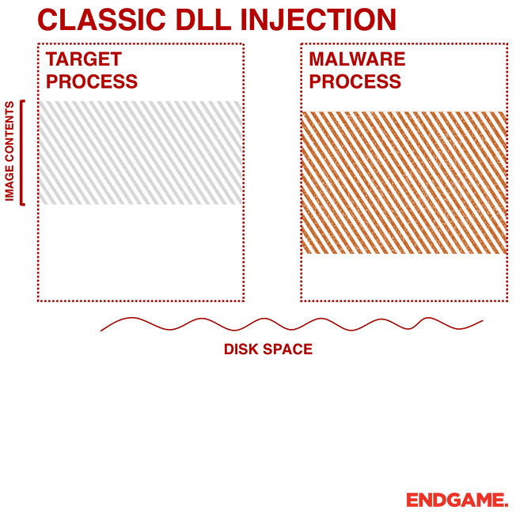
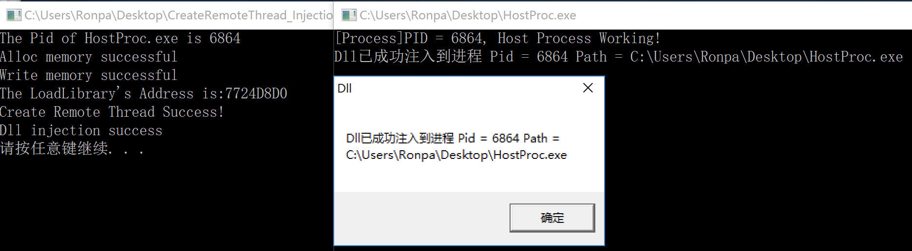
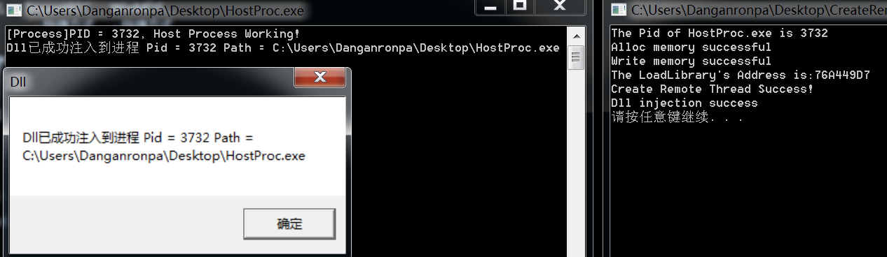
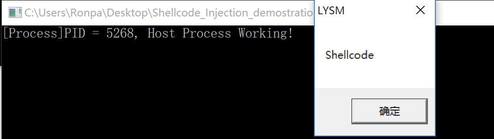
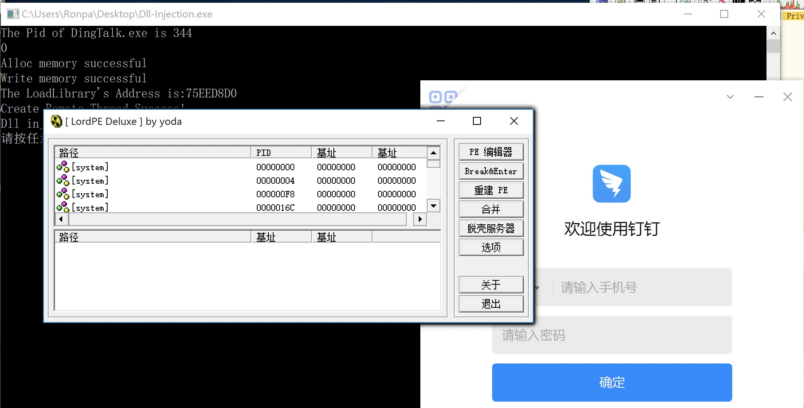

# CreateRemoteThread

## Introduction
启动器远程让目标进程生成一个名下的线程, 用来加载恶意dll或者直接运行shellcode. 

使用`CreateRemoteThread`创建目标进程的线程`LoadLibrary`加载DLL或者shellcode.


### 简略过程(dll&shellcode)
#### 搜索:

1. `CreateToolhelp32Snapshot`枚举所有进程的堆或模块状态的API, 返回一个快照.
2. `Process32First`检索快照中有关第一个进程的信息, 中途用`stricmp(Processname,pe32.szExeFile)`的方式对比进程名
3. 然后在循环中使`Process32Next`来遍历快照

也有用`FindwindowA()`和`GetWindowThreadProcessId()`, 通过窗口名称来寻找目标进程的.


#### 注入(两种)

1. dll注入:
	* 打开目标进程句柄 `hProc = OpenProcess(..)`
	* 向目标进程中开辟空间 `VirtualAllocEx(hProc, 目标空间(NULL的话系统分配), sizeof(dll名字),..)`
	* 并写入Dll文件路径 `WriteProcessMemory(hProc, 目标空间, 写入的内容, 长度)`
	* 获取`LoadLibraryA`的地址 `GetProcAddress(GetModuleHandle("Kernel32.dll"),"LoadLibraryA")`
	* 利用`CreateRemoteThread`函数, 在目标进程下创建线程`LoadLibrary`加载dll

(`NtCreateThreadEx`或`RtlCreateUserThread`也行, 为文档化的函数)

2. shellcode注入:
	* 打开目标进程句柄 `hProc = OpenProcess(..)`
	* 向目标进程中开辟空间 `VirtualAllocEx(hProc, 目标空间(NULL的话系统分配), sizeof(shellcode的长度),..)`
	* 并写入shellcode `WriteProcessMemory(hProc, 目标空间, 写入的内容, 长度)`
	* 利用`CreateRemoteThread`函数, 在目标进程下创建线程, 线程开头指向shellcode的空间.


## 关键代码注释

**dll injection:** 本文对应的demo, 可以往自己写的`HostProc.exe`程序里, 注入`MsgDll.dll`. 使其弹出显示注入成功的对话窗口.



**shellcode injection:** 本文对应的demo, 可以往自己写的`HostProc.exe`程序里, 注入弹出对话框窗口.


### 搜索目标进程

```
DWORD GetProcessPid(char *Processname)
{
	HANDLE hProcessSnap = NULL;   //define snapshot
	DWORD ProcessID = 0;
	PROCESSENTRY32 pe32 = { 0 };
	hProcessSnap = CreateToolhelp32Snapshot(TH32CS_SNAPPROCESS, 0);   //create snapshot of all process in system
	pe32.dwSize = sizeof(PROCESSENTRY32);
	if (Process32First(hProcessSnap, &pe32))
	{
		do
		{
			//cout << pe32.szExeFile << endl;
			if (!strcmp(Processname, pe32.szExeFile)) //对比搜索结果是否是目标process
			{
				ProcessID = pe32.th32ProcessID;
				break;
			}
		} while (Process32Next(hProcessSnap, &pe32)); //直到下一个process 为NULL
	}
	CloseHandle(hProcessSnap);
	return ProcessID; //返回目标进程的ID
}
```

### 打开目标进程并申请空间

```
	HANDLE hProc = NULL;
	hProc = OpenProcess(PROCESS_ALL_ACCESS, FALSE, Pid);

	// alloc memory in process for dll name or shellcode
	LPVOID AllocMemory = VirtualAllocEx(hProc, NULL, lstrlen(Dll) + 1, MEM_COMMIT, PAGE_READWRITE);
	//LPVOID AllocMemory = VirtualAllocEx(hProc, NULL, sizeof(shellcode), MEM_COMMIT, PAGE_READWRITE);
```
### 往申请的空间内写入数据(dll&shellcode)
#### dll

```
	// write Dll route to process memory allocated;
	WriteProcessMemory(hProc, AllocMemory, Dll, lstrlen(Dll) + 1, NULL);
```

#### shellcode

```
	WriteProcessMemory(hProc, AllocMemory, shellcode, sizeof(shellcode), NULL);
```

### 创建远程线程(dll&shellcode)
#### dll
虽然启动器和目标进程是两个不同进程, 但是部分系统dll在不同进程中的地址是相同的, 所以可以在启动器进程中加载`Kernel32`获得的`LoadLibraryA()`的地址在目标进程中也能用.

```
	// Get address of 'LoadLibrary()', and set start address of thread.
	PTHREAD_START_ROUTINE pfnStartAddr = (PTHREAD_START_ROUTINE)GetProcAddress(GetModuleHandle(TEXT("Kernel32")), "LoadLibraryA");

	HANDLE hRemoteThread = NULL;
	hRemoteThread = CreateRemoteThread(hProc, NULL, 0, pfnStartAddr, AllocMemory, 0, NULL);
```
#### shellcode
这里和注入dll文件的程序入口点在loadlibrary不同, 要设置到shellcode开头. <br />调试可以使用OD, 过程参考[https://mp.weixin.qq.com/s/GdB9yTyfTeFvTJzamlbw2w](https://mp.weixin.qq.com/s/GdB9yTyfTeFvTJzamlbw2w)

```
	CreateRemoteThread(hProc, NULL, 0, (LPTHREAD_START_ROUTINE)AllocMemory, 0, 0, NULL);
```

## 补充
### 适用范围

1. **Windows XP/Server 2003**, 因为`CreateRemoteThread`函数**新添加了会话检查**, 不在同一个会话里, 调用`CsrClientCallServer`为新线程进行登记的操作, 就会创建线程失败.
2. 所以可以对`KernelBase.dll`中的`CreateRemoteThread`函数里的关键判断语句nop掉(有个跳转`jl`, 失败会跳转)
3. 经过测试, **win7/10**均可使用此方法, 所以上面两条内容真实性存疑

### 缺点

1. `CreateRemoteThread`被许多安全产品跟踪和标记。 
2. 会在磁盘上的留下恶意DLL文件
3. 太老了, `VirtualAlloc`被看的很死.

### 后续版本 dll注入 version2.0

* 重新写了一下注入的dll文件, 改成了直接打开另外一个程序
* 实现了能往钉钉里注入dll文件, 然后弹窗(如下图是弹出`LordPE.exe`).


## Reference Resources

1. (`加密与解密第四版/加密解密实例/PEDIY_BOOK4/chap12/6.InjectDll(RemoteThread)`, 记得把dll放到正确的目录下)
2. `Rebhip`恶意软件便是利用了这种注入技巧
3. 看雪论坛上的一个dll注入样本实现 [https://bbs.pediy.com/thread-224078.htm](https://bbs.pediy.com/thread-224078.htm) 
4. shellcode注入, 里面讲了如何调试, 非常有用[https://mp.weixin.qq.com/s/GdB9yTyfTeFvTJzamlbw2w](https://mp.weixin.qq.com/s/GdB9yTyfTeFvTJzamlbw2w)
5. shellcode代码参考, 内置`messagebox`shellcode[https://www.cnblogs.com/LyShark/p/15019189.html](https://www.cnblogs.com/LyShark/p/15019189.html)


# 知识补充

## 进程 线程 模块 PID 句柄

### 进程

* 进程是一个正在运行的程序 **进程里可以包括多个模块(DLL,OCX,等)**
* 进程是表示资源分配的的基本概念，又是调度运行的基本单位，是系统中的并发执行的单位
* 每个进程有自己独立的image, 内存空间.

一个任务就是一个进程（Process），比如打开一个浏览器就是启动一个浏览器进程，打开一个记事本就启动了一个记事本进程，打开两个记事本就启动了两个记事本进程。

### 线程

* 一个线程代表进程里代码的一条执行线路。是进程中执行运算的最小单位。
* 进程本身是惰性而不执行任何代码的，**每个进程至少有一个主线程**，由主线程在进程的环境里执行代码。当然，也可以有多个线程。
* 线程**没有地址空间**，线程包含在进程的地址空间中(所有线程共享内存). 线程上下文只包含**一个堆栈、一个寄存器、一个优先权**(Thread Hijack)，线程文本包含在他的进程的文本片段中，进程拥有的所有资源都属于线程。所有的线程**共享进程的内存和资源**。

有些进程还不止同时干一件事，比如Word，它可以同时进行打字、拼写检查、打印等事情。在一个进程内部，要同时干多件事，就需要同时运行多个“子任务”，我们把进程内的这些“子任务”称为线程(Thread).

### 进程ID (Pid)

`DWORD Pid`

* 表示某个process**对应的编号**, 每个process有自己对应的唯一的Pid.
* 一个进程可以有**多个句柄但是ID就只有一个**,可以通过ID打开多个句柄.
* 在任何进程中都可使用该ID号访问进程对象, **例如`CreateRemoteThread`注入里, 启动器进程就是使用Pid找到目标进程的.**
* 进程ID，一个进程被创建后这个进程ID就是不变的。

### 句柄 (Handle)

`HANDLE hProc`

* 句柄实际是一个**指针**，他指向一块包含具体信息数据的内存. 所以可以用来**访问操作进程**.
* 进程句柄是当你要访问该进程时取得的，使用完毕必须释放。
* 进程的句柄则是基于特定进程的，对于同一个进程对象，在不同的进程中可能有不同的句柄值。因为句柄实际上是进程空间中的句柄表的偏移，由于在不同的进程空间中句柄表是不同的，针对相同的对象在句柄表的偏移也就不一样了.
* 进程句柄，每次打开这个进程(OpenProcess)，返回给你的**句柄是变化的**

Handle相当于一个process的实例, 用来操作process. 如下代码, 通过Pid打开process, 使用`hProc`代表打开的process.

`HANDLE hProc = OpenProcess(PROCESS_ALL_ACCESS, FALSE, Pid)`

### 模块

**进程是一个正在运行的程序 进程里可以包括多个模块(DLL,OCX,等)**

搜了一下stackoverflow上的解释, 模块的定义很模糊, 没有一个标准.

