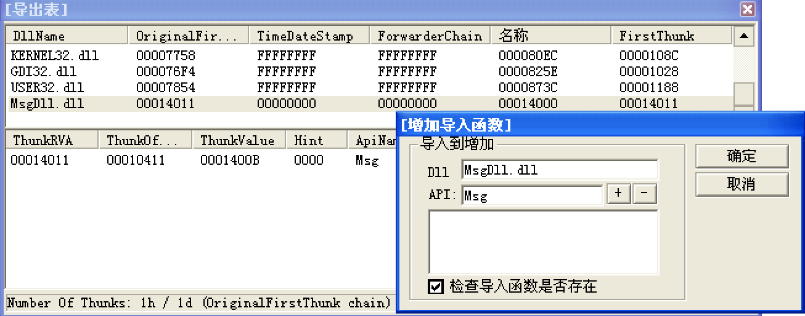
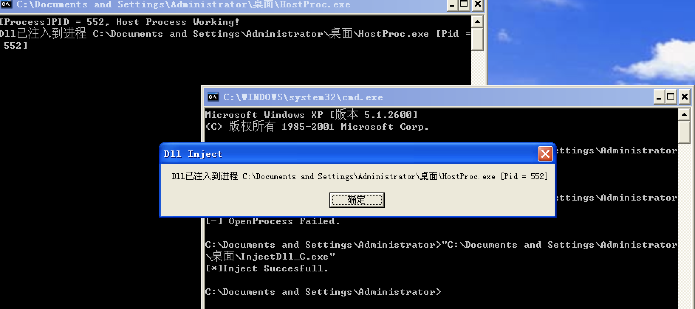

> 补缺 参考 加密解密第四版(例子太老了)
> https://bbs.pediy.com/thread-220500.htm

<!--more-->

# DLL注入

## 简介

Dll注入可以从三个方向入手：

1. 在进程创建初期按照导入表加载dll的时候。
	* DLL劫持
	* 修改IT
2. 进程运行时期利用`LoadLibrary`函数加载
	* `CreateRemoteThread`
	* `RtlCreateUserThread()`
	* APC插队 进程
	* 进程替换
3. 利用某些系统机制：例如windows消息机制等
	* `SetWindowHook`
	* 注册表
	* 输入法

### 注入的dll代码

MsgDll.dll:

```
BOOl APIENTRY DllMain(HANDLE hMoudule, DWORD ul_reason_for_call, LPVOID lpReserved)
{
    if (ul_reason_for_call == DLL_PROCESS_ATTACH)
    {
        CreateThread(NULL, 0, ThreadShow, NULL, 0, NULL);
    }
    return TRUE; 
}h
DWORD WINAPI ThreadShow(LPVOID lpParameter)
{
    char szPath[MAX_PATH]={0};
    char szBuf[1024]={0};
    //获取宿主进程的全路径
    GetModuleFileName(NULL, szPath, MAX_PATH);
    sprintf(szBuf, "DLL已注入到进程 %s [Pid = %d]\n", szPath, GetCurrentProcessId());
    //以3种方式显示自己的存在
    //1. MessageBox
    MessageBox(NULL, szBuf, "DLL注入成功, 恭喜踏出第一步", MB_OK);
    //2. 控制台
    printf("%s",szBuf);
    //3. 调试器
    OutputDebugString(szBuf);
    return 0;
}
```

## DLL劫持

DLL劫持法(输入表DLL替换法)，原理是利用**搜索DLL路径存在先后顺序**(exe程序目录>系统目录>当前目录>Path),**当较高层存在一个同名的DLL文件的时候**，就会直接加载较高层的DLL文件。常常用于病毒的白加黑。需要注意的是黑DLL路径优先级一定要高于原来的dll文件，第二，一定要具有源dll文件所有的导出函数。

**DLL劫持的注入方法会面临部分系统dll无法被劫持的问题**(因为像`ntdll`这种是进程创建前就已经加载了, 它的路径在启动阶段就已经被设置好程序会去`system32`找, R3下的任何劫持都无效)

可以劫持的dll大概有：

**lpk.dll, usp10.dll, version.dll, msimg32.dll, midimap.dll, ksuser.dll、comres.dll, ddraw.dll**

### demo
使用 `AheadLib`自动生成导出函数的转发dll cpp代码, 如下图是生成的`LPK.dll`的劫持dll代码.


1. 生成的假的 `LPK.dll` 放在被劫持程序的目录下, 保证最高搜索优先级
2. 把原始的 `LPK.dll`复制并修改名称为`lpkOrg.dll`, 随便放在能搜到的地方. 用于转发.

```
#include <Windows.h>

#pragma comment(linker, "/EXPORT:LpkInitialize=lpkOrg.LpkInitialize,@1")
#pragma comment(linker, "/EXPORT:LpkTabbedTextOut=lpkOrg.LpkTabbedTextOut,@2")
#pragma comment(linker, "/EXPORT:LpkDllInitialize=lpkOrg.LpkDllInitialize,@3")
#pragma comment(linker, "/EXPORT:LpkDrawTextEx=lpkOrg.LpkDrawTextEx,@4")
#pragma comment(linker, "/EXPORT:LpkEditControl=lpkOrg.LpkEditControl,@5")
#pragma comment(linker, "/EXPORT:LpkExtTextOut=lpkOrg.LpkExtTextOut,@6")
#pragma comment(linker, "/EXPORT:LpkGetCharacterPlacement=lpkOrg.LpkGetCharacterPlacement,@7")
#pragma comment(linker, "/EXPORT:LpkGetTextExtentExPoint=lpkOrg.LpkGetTextExtentExPoint,@8")
#pragma comment(linker, "/EXPORT:LpkPSMTextOut=lpkOrg.LpkPSMTextOut,@9")
#pragma comment(linker, "/EXPORT:LpkUseGDIWidthCache=lpkOrg.LpkUseGDIWidthCache,@10")
#pragma comment(linker, "/EXPORT:ftsWordBreak=lpkOrg.ftsWordBreak,@11")
////////////////////////////////////////////////////////////////////////////////////////////////////////////////////////


BOOL WINAPI DllMain(HMODULE hModule, DWORD dwReason, PVOID pvReserved)
{
	if (dwReason == DLL_PROCESS_ATTACH)
	{
		CreateThread(NULL,0,ThreadWorking,NULL,0,NULL);
		DisableThreadLibraryCalls(hModule);
	}
	else if (dwReason == DLL_PROCESS_DETACH)
	{
	}

	return TRUE;
}

DWORD WINAPI ThreadWorking(LPVOID lpParameters)
{
	Sleep(500);
	MessageBox(NULL,"Fake Lpk loaded!","Notice",MB_OK);
	OutputDebugString("Lpk.dll is working.\n");
	return 0 ;
}
```


## 修改IT导入表

用loadPE直接添加DLL文件 和对应函数

把 自行编写的DLL `MsgDLL.dll` 加载进 记事本程序 `notepad.exe`. 使启动记事本的时候能自动跳出 MessageBox .

思路很清晰, 直接修改记事本这个target software的导入表, 强行注入dll就行. 

### 使用LoadPE 添加导入表

我无语了, 跟着书里做了半天, 整篇似懂非懂得 手动实操出来一个不能运行的东西时 发现文章末尾推荐直接用软件完成注入💩.

右键增加导入函数(只支持pe32) 


### 适用条件

1. EXE文件本身**无校验**(CRC, 数字签名, fingerprint等), 因为修改了EXE程序内部的数据.
2. 但可通过直接修改文件加载的第三方模块(dll)的输入表, 套娃.
3. 假如模块也有校验就不行了.
4. **32位exe**


## 远线程注入 使用`CreateRemoteThread`
启动器让目标程序加载恶意dll. 使用`CreateRemoteThread`创建目标进程的线程`LoadLibrary`加载DLL. 参考样例(`加密与解密第四版/加密解密实例/PEDIY_BOOK4/chap12/6.InjectDll(RemoteThread)`, 记得把dll放到正确的目录下)

1. 使用`CreateRemoteThread`函数
2. 传入三个参数
	* `OpenProcess`函数获得的进程句柄
	* 线程参数`hpParameter`
	* 注入线程的入站口 `lpStartAddress`
3. 例如把入口点设置成`LoadLibrary`, 就能自然的让进程加载目标DLL

具体过程:

1. 打开目标进程句柄 `hProc = OpenProcess(..)`
2. 向目标进程中开辟空间 `VirtualAllocEx(hProc,.., sizeof(dll名字),..)`
3. 并写入Dll文件路径 `WriteProcessMemory(hProc, dll名字, 大小..)`
4. 获取`LoadLibraryA`的地址 `GetProcAddress(GetModuleHandle("Kernel32.dll"),"LoadLibraryA")`
5. 利用`CreateRemoteThread`函数调用LoadLibrary加载dll



适用范围:

1. Windows XP/Server 2003, 之后的则不行, 因为`CreateRemoteThread`函数**新添加了会话检查**, 不在同一个会话里, 调用`CsrClientCallServer`为新线程进行登记的操作, 就会创建线程失败
2. 所以可以对`KernelBase.dll`中的`CreateRemoteThread`函数里的关键判断语句nop掉(有个跳转`jl`, 失败会跳转)

## `RtlCreateUserThread()`

`RtlCreateUserThread`是`CreateRemoteThread`的底层实现，所以使用`RtlCreateUserThread`的原理是和使用`CreateRemoteThread`的原理是一样的

唯一的区别是使用`CreateRemoteThread`写入目标进程的是Dll的路径，而`RtlCreateUserThread`写入的是一段`shellcode`


## APC注入(异步过程调用)

APC是一个链状的数据结构，可以让一个线程在其本应该的执行步骤前执行其他代码，**每个线程**都维护这一个APC链. 

往线程APC队列添加APC，系统会产生一个**软中断**。在线程下一次被调度的时候，就会执行APC函数

在A线程中向B线程插入一个APC，插入的动作是在A线程中完成的，但什么时候执行则由B线程决定,

原理:

1. 当程序执行到某一个的**等待函数**的时候(`SleepEx`,`signalObjectAndWait`等),系统会产生一个中断
2. 当线程被唤醒的时候,这个线程会优先去**Apc队列中调用回调函数**
3. 我们利用`QueueUserApc`,往这个队列中插入一个回调(目标loadlibrary)
4. 插入回调的时候, 把插入的回调地址改为**LoadLibrary**, 插入的参数我们使用`VirtualAllocEx`申请内存, 并且写入进去

代码流程:

1. 打开目标进程句柄 `hProc = OpenProcess(..)`
2. 将**DLL文件路径写入进程**. 用`VirtualAllocEx`和`WriteProcessMemory`
3. **获取当前线程句柄**, 这里为了增加命中率, 遍历进程下的所有线程 `HANDLE hThread = OpenThread(THREAD_ALL_ACCESS,FALSE,te32.th32ThreadID)`
4. 插入APC队列`QueueUserAPC((PAPCFUNC)LoadLibraryA, hThread, (ULONG_PTR)lpData)`
5. 使用`QueueUserAPC`将APC例程添加到APC队列中，QueueUserAPC三个参数分别是APC例程，线程句柄，例程参数。所以还需要获取线程句柄. 例如上面的例子就是插入了`LoadLibrary`线程, 参数是DLL文件路径 

## `SetWindowsHookEx()`设置钩子

利用`SetwindowsHookEx`。调用钩子处理函数来处理这个消息. 

消息钩子(Message Hook)是Windows消息处理机制的一个监视点，系统会自动将钩子安装到目标进程中达到监视指定类型消息的功能。也就是说通过`SetWindowsHookEx` **系统会自动将钩子dll**注入到目标进程。

**其中dwThreadId为0时，则是全局钩子，即会注入dll到系统所有窗口进程**

**注意: 编写简单。xp上可以注入dll到系统进程，但win7上，由于Session 0 隔离机制，不能注入系统进程。同时由于权限隔离，不能注入到高等级的进程中。**

## 注册表

所有使用`User32.dll`的进程都会自动调用LoadLibrary去加载注册表中某个**表项键值**里写入的Dll路径

`AppInit_DLL`键值
 
注册表项`HKEY_LOCAL_MACHINE\SOFTWARE\Microsoft\Windows NT\CurrentVersion\Windows`中有两个值：

1. `LoadAppInit_Dlls`：键值中指定要注入的DLL
2. `AppInit_Dlls`：若其键值为1,则注入`LoadAppInit_Dlls`中指定的DLL，若为0则不注入。


**注意: 简单，但只能注入GUI进程**

## 输入法注入


## 进程替换

可以往进程里写shellcode和DLL路径, 执行LoadLibrary注入DLL

1. 恶意软件首先**创建一个新进程**，以**挂起模式托管恶意代码**。通过调用`CreateProcess`并将流程创建标志设置为`CREATE_SUSPENDED`（0x00000004）完成。`CreateProcess(...,"目标宿主进程.exe",CREATE_SUSPENDED)；//以挂起状态创建进程`
2. 新进程的**主线程被创建为挂起状态**，直到`ResumeThread`函数被调用才会运行。
3. 接下来，恶意软件需要用恶意代码来替换合法文件的内容。这可以通过调用`ZwUnmapViewOfSection`或`NtUnmapViewOfSection`来**取消映射目标进程的内存**。这两个API基本上释放了一个部分指向的所有内存。
4. 现在内存被取消映射，加载器执行`VirtualAllocEx`为恶意软件分配新内存，并使用`WriteProcessMemory`将每个恶意软件的部分写入目标进程空间。
5. 恶意软件调用`SetThreadContext`将entrypoint指向已编写的新代码段。最后，恶意软件通过调用`ResumeThread`来恢复挂起的线程。

## 直接注入

两次`VirtualAllocEx`和`WriteProcessMemory`的调用, 最后使用`CreateRemoteThread`直接执行那块代码.

1. 复制代码所需数据
2. 打开目标进程：
3. 开辟内存空间，为了存储数据
4. 写入数据
5. 开辟进程空间，为了存储代码
6. 写入代码
7. 调用CreateRemoteThread()进行代码注入

## DLL注入防御

### 驱动层

1. 拦截高危操作, 例如`OpenProcess`, `OpenThread`, `VirtualAlloc`, `WriteVirtualMemory`, 创建线程等操作.

### 应用层

1. 在创建远程线程创建初期在`DllMain`中防御远程线程，此时尚未调用`LoadLibrary`。可以对线程的合法性判断
2. `LoadLibrary`之前首先可以hook `LoadLibrary`函数，然后检查dll路径合法性. 就是每次调用loadlibrary时, 都需要检测load进去的dll是否合法(微软签名)
3. `LoadLibrary`之后枚举可疑内存和模块, 扫描到一块可写可读可执行的内存, 估计就是隐藏dll


# HOOK

## hook方式

### IAT Hook (ring3)

替换IAT表中函数地址, 在调用正确的API前运行恶意代码
导入表hook原理：修改导入表中某函数的地址到自己的补丁函数

1. 通过`GetProcAddress`获取目标函数地址
2. 获取你HOOK程序的 **ImageBase以及各种头(DOS,NT,FILE,OPT)**
3. 通过OPT的数据目录第一项.得到**导入表RVA**.加上**ImageBase**定位到导入表
4. 循环遍历导入表.
5. 通过导入表找到IAT表(目标函数地址保存的位置).继续遍历IAT表.
6. 判断IAT中的函数地址,是否是你要进行HOOK的函数地址.
	* 是: 把**地址修改**为自己补丁函数
	* 不是: 继续循环.
7. 在IAT表中没找到.说明没在这个导入表中.导入表+1(一个导入表结构大小)
8. 继续循环.

[https://cloud.tencent.com/developer/article/1444069](https://cloud.tencent.com/developer/article/1444069)

问题：当该函数**递归调用**时，不会被hook 过时容易探测

### InLine Hook (ring3 ring0)
直接修改代码指令的hook, 修改API的开头(修改代码), 让它跳到恶意代码, 然后再通过trampoline跳回去. 发生在API被加载后的过程.

[/Users/ronpa/Blog/source/_posts/恶意代码分析实战-实验记录Lab7-9.md](/Users/ronpa/Blog/source/_posts/恶意代码分析实战-实验记录Lab7-9.md)

**inline hook 如何保证栈和寄存器不变:**

inline hook时别直接跳转到replace函数，先跳转到**一级跳板函数**内，在一级跳板函数内**对寄存器和堆栈进行备份**，调用原函数时，在真正执行原函数调用跳板前，先对寄存器和堆栈进行恢复即可.

### hook操作的多线程安全(并发hook)
hook操作的多线程安全, 简单来说就是在改写开头跳转到detour代码块的前5个字节的时候, 可能被别的线程插队, 导致改写的指令错误.

以往我们在HOOK的时候会使用`memcpy`这个函数，但是这个只能一个一个替换, 如果你还没有替换完成的时候，别的函数在调用，就会出错。

1. **枚举目标进程里的所有线程**, 把除当前线程外的线程全部挂起, 直到修改结束.
2. 上锁, 把地址锁住, lock cmpxchg 指令, (使用CMPXCHG8B 指令，该指令可以原子操作一次性的替换掉8字节的内存) `lock CMPXCHG8B [esi]`
	* 该指令判断指定内存中的8字节内容和EDX:EAX （edx高32位，eax,低32位）中的64字节内容是否相同，如果相同，就把ECX:EBX（ecx高32位，ebx,低32位）中的内容替换到指定内存。如果不相同，就把指定内存中的值替换到ECX:EBX中。

### SSDT hook(ring0)

Windows把需要调用的内核API地址全都存在了一个表中（System Service Dispatch Table），要想hook一个内核API，比较简单的办法就是把该内核API在表（SSDT）中**保存的地址**修改为自己撰写的函数地址。 (有点类似IAT hook)


这个表就是一个把 Ring3 的 Win32 API 和 Ring0的内核 API 联系起来, 就是ring3的API需要进一步调用哪个ring0层的API


### VEH_HOOK 向量异常处理

VEH技术的主要原理是利用**异常处理改变程序指令流程**。通过**主动抛出异常，使程序触发异常**，控制权交给异常处理例程(例程=API)的这一系列操作来实现HOOK。

1. 构造TrampolineFun
2. 构造异常处理函数，即Detour函数, 在里面写上想要的操作
3. 人为构造异常。例如这里选择的是简单的断点异常。直接将Target原始代码修改一个字节为0xCC即可(数组越界,内存访问出错,无效参数,int 3)

1. 添加异常处理函数  并指定参数为第零个 (第一个执行)
2. 备份MessageBoxA的第一个字节.
3. 人为构造异常, 在MessageBoxA第一个字节写入int3(cc)

### 对抗/检测HOOK

**x86下:**

1. HOOK修改的是**内存中的数据**，本地文件(**dll文件的导出表**)却没有修改。可以将本地文件加载到内存中，然后进行对比导出表, 地址校验. 或者为每个子版本的系统关键API做逆向分析，取出**特征码**，当系统更新或者打补丁，则需要再次逆向分析取出特征码.
2. 对内存模块进行**CRC校验**
3. 设置回调函数，**检测某个IAT或者函数的前几个指令是否被修改**
4. 对`VirtualProtect`函数和`WriteProcess`函数进行HOOK，检测修改内容的合法性, 禁止高危操作, **监控**申请资源等修改别的进程的内存的**高危行动**, 
5. **修改内存的读写性**, 无法修改内存.
6. **防止别的进程打开目标进程**, 对目标进程进行修改. (hook `OpenProcess`获取句柄 进程地址空间)

7. 拦截内核中进程创建的关键API如`nt!NtCreateProcess`或`nt!NtCreateProcessEx`/(`CreateThread`)，通过堆栈来回溯到关键参数，如待创建进程的exe全路径、父进程信息，然后根据获取到的全路径检测exe磁盘文件，同时也可以分析进程链最终确定是否放行该动作. **这种更像是分析恶意软件的不是hook**

**x64下:**

推出了诸如KDP（Kernel Data Protection）、PG等安全措施，使得传统的Hook技术失效；
使得安全软件能够在内核可控的情况下提供安全服务，Windows系统层面提供了一种基于回调的方式来通知安全软件**注册的内核回调例程(例程=API)**。 具体分析见[https://baijiahao.baidu.com/s?id=1690670411934669760&wfr=spider&for=pc](https://baijiahao.baidu.com/s?id=1690670411934669760&wfr=spider&for=pc)

简单来说没办法hook内核API 或者ring3的API, 但可以使用`PsSetCreateProcessNotifyRoutineEx`注册回调函数，**每次进程创建、退出**的时候, 都会调用注册的例程进行检测.

1. 例如, 当用户态进程调用`RtlCreateUserProcess`、`RtlCreateUserProcesersEx`或`RtlExitUserProcess`时，
2. 内核都会去遍历`PspCreateProcessNotifyRoutine`数组，依次执行回调例程，通知给驱动程序做相应的处理。
3. 驱动接管之后，可以做**安全校验处理**，**分析进程的父进程**或者**进一步分析进程链**，
4. 此外还可以对即将被拉起的子进程做特征码匹配，**PE指纹识别**，**导入表检测**等防御手段。

这种方式不需要去Hook任何API，也无需做特征码定位等重复繁琐的工作，完全基于系统提供的回调机制，且在Windows系统中都可以无缝衔接。

7. 利用`PsSetCreateProcessNotifyRoutineEx`注册回调函数，监控**进程创建**.
	* 当有进程创建或者退出时，系统会回调参数中指定的函数
	* 回调例程安装完之后，如果有新的进程创建或退出，内核则便会遍历该数组来执行其中安装的每一项回调例程
	* 对比特定的进程，如果创建，设置创建标志为假，创建失败
8. 利用`PsSetCreateThreadNotifyRoutine`注册回调函数，监控**线程创建**，通过进程路径. 找到对应进程名. 判断是否符合，如果是的话.找到回调函数地址( pWin32Address = (UCHAR**)((UCHAR)Thread + 0x410);)并改为C3
9. 利用`PsSetLoadImageNotifyRoutine`拦截模块，首先需要获取模块基地址(让其载入)，PE寻找基地址，解析到OEP，修改oep为ret即可

### 二次HOOK

首先是二次HOOK，就是被别人HOOK了之后自己再次HOOK，这里可以提供4种方法，

1. 可以换个位置HOOK。
2. 第二就是替换原HOOK，也就是说将别人HOOK的指令修改为自己HOOK的指令。但是需要注意的是修改指令数量一定要和对方的一致，或者修改之前将原来的HOOK还原
3. 第三，在Detour函数中HOOK，
4. 第四，在Target函数中的原来HOOK的地址后面HOOK。
 
第二是X64下HOOK应该注意什么？

1. 首先X64和X86本质区别就是地址总线上的差别，一个是2^64次，一次传输64位数据，一个是2^32次，一次传输32位数据。
2. 由此造成的差异就是内存地址大小问题，在32位机器上主要是4个字节，64位机器上就变成了8个字节。这样的话对于指针的使用就需要考虑到两个架构上的兼容性和差异性。
3. 例如在32下可以使用`ULONG`，但是在64位下使用`ULONG_PTR`。这样就可以有效避免由于编码问题产生的异常(或者统一使用`ULONG_PTR`)。
4. 第二就是PE格式上，由于x86和x64PE结构上存在微小差异，所以在进行``AddressHook`的时候需要注意。
5. 第三可能涉及到跳转的问题。
 

 
