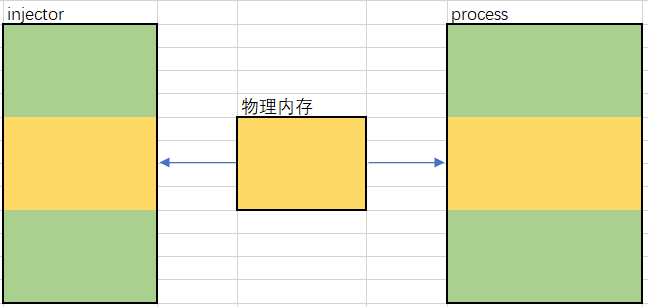

# Mapping Injection

## 简介

有点类似Process Hollowing, 映射恶意代码到已存在的进程的内存空间. 

主要是不像别的注入方式要使用`VirtualAlloc`和`WriteProcessMemory`. 所以可以结合别的注入方式, 例如使用APC注入替换`CreateRemoteThread`. 有多重组合方式

## 1. CreateFileMapping → MapViewOfFile → MapViewOfFile2

### 步骤简介

1. 创建 section, 即文件映像.
	* CreateFileMapping
2. 将mapping映射到注入进程虚拟地址, 利用file view
	* MapViewOfFile
3. 往被映射的虚拟地址写入shellcode
	* memcpy
4. 将mapping映射到被注入进程的虚拟地址, 也是通过file view
	* OpenProcess
	* MapViewOfFile2
5. 启动运行shellcode
	* CreateRemoteThread
	* UserQueueAPC

### 特点

1. 在注meterpreter生成的远控shellcode(还有弹计算器的)的时候, 老是失败, 无论是简单的HostProc.exe还是DingTalk.exe.
	* 回头看一下注入后的内存情况, 按理说是没问题的.
	* 换成APC启动shellcode试试?
2. 其他的注入像是弹对话框倒是没事

## Reference

1. [https://idiotc4t.com/code-and-dll-process-injection/mapping-injection](https://idiotc4t.com/code-and-dll-process-injection/mapping-injection)
2. [http://blog.leanote.com/post/snowming/a0366d1d01bf](http://blog.leanote.com/post/snowming/a0366d1d01bf)

# 知识补充

## 文件映射

